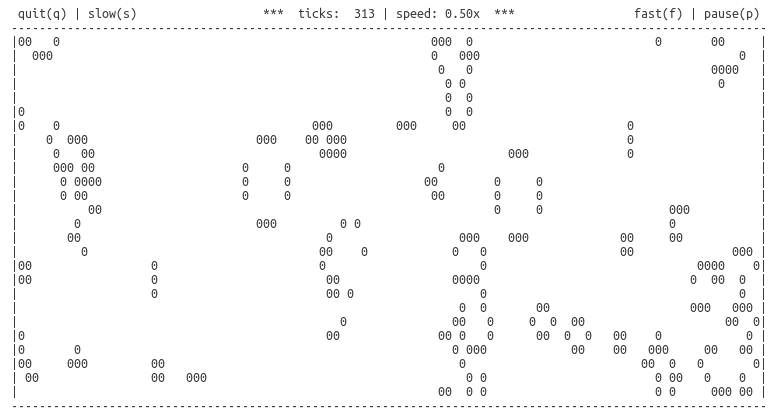

# Game of Life

Simulate the game of life on the terminal.

|                             |                             |
| --------------------------- | --------------------------- |
|  |  |
|  |  |

Features:

- Random starting cells each time.
- Aware of terminal size. Will restart simulation with new size when you:
  - Zoom in/out
  - Font-size increase/decrease
  - Resize terminal window
- Simulation Controls
  - Pause / Unpause, Quit Simulation
  - Slower / Faster Simulation

Requirements:

- linux terminal
- gcc
- cmake
