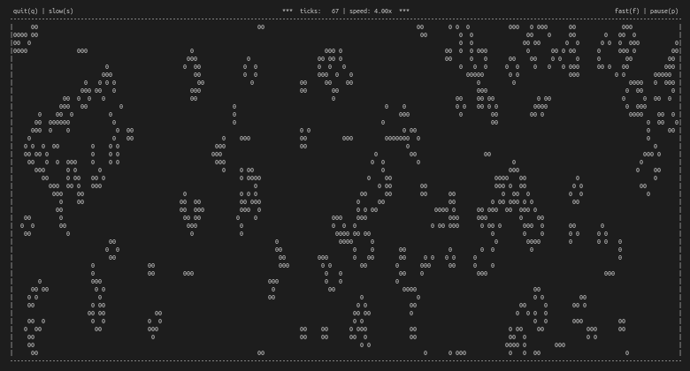

# Game of Life

Simulate the game of life on the terminal.

## Features:

- Random starting cells each time.
- Aware of terminal size. Will restart simulation with new size when you:
  - Zoom in/out
  - Font-size increase/decrease
  - Resize terminal window
- Simulation Controls
  - Pause / Unpause, Quit Simulation
  - Slower / Faster Simulation

## Requirements:

- linux terminal
- gcc
- cmake

## Instructions:

- run `./build_all.sh` to build executable
- run `./bin/Game_Of_Life` to run executable

